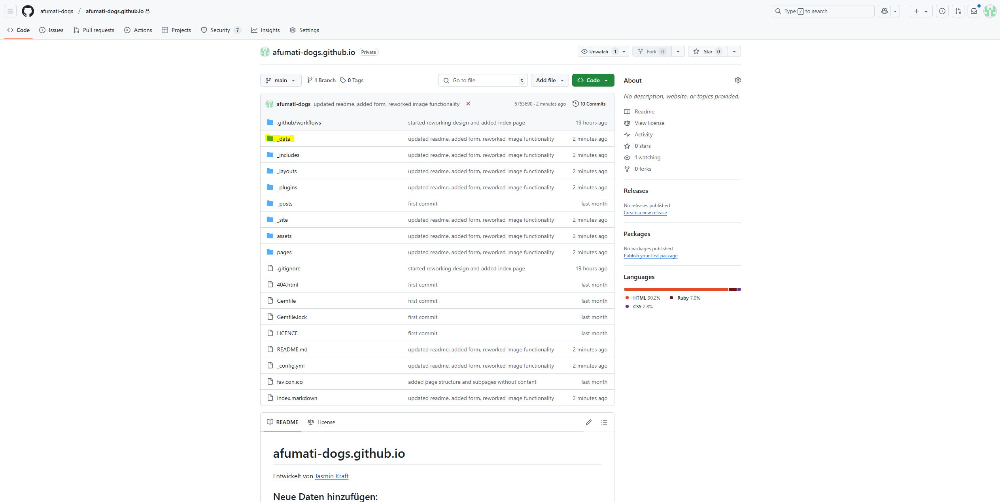
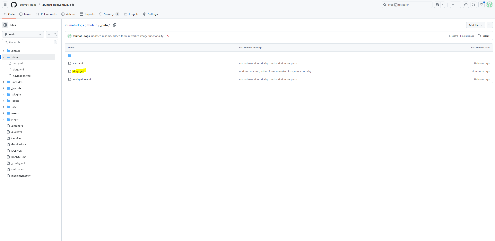
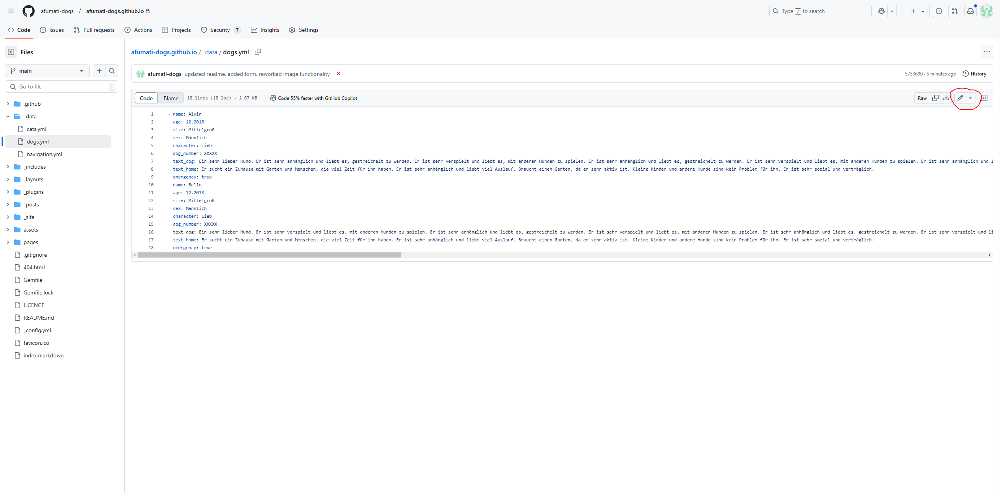
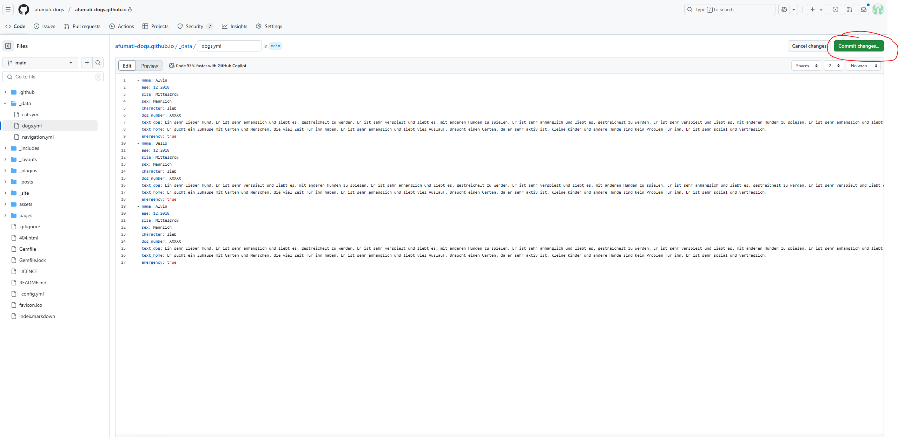
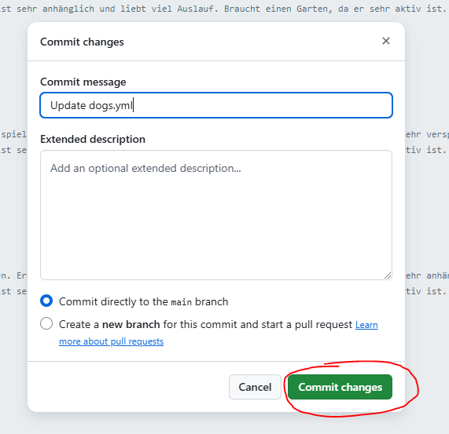
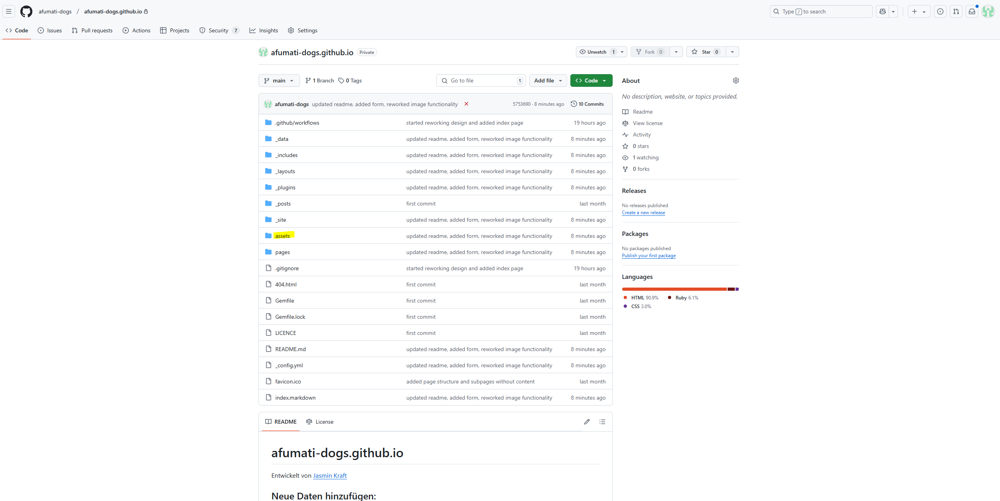
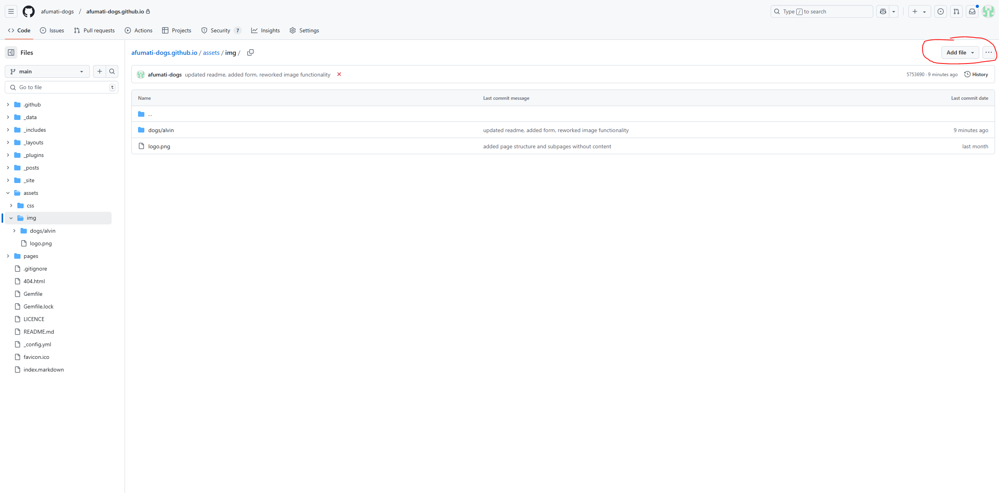
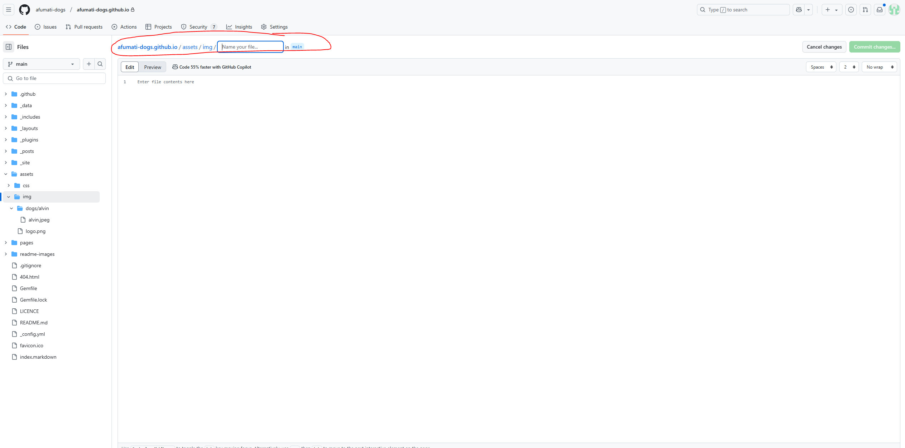
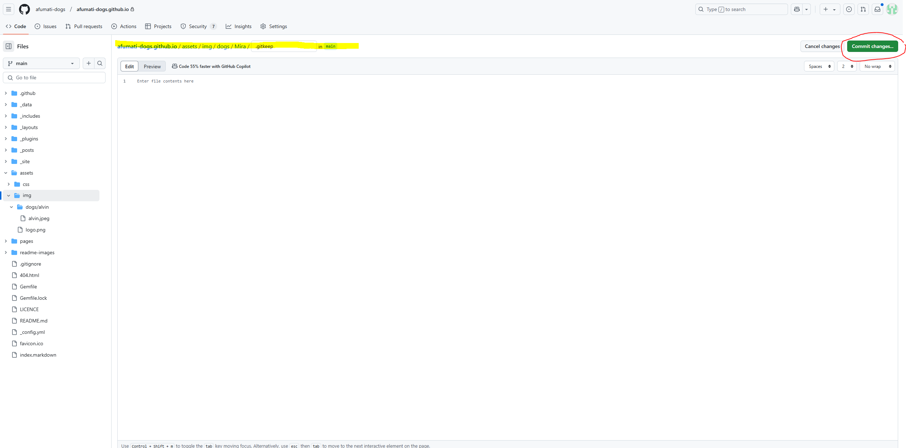
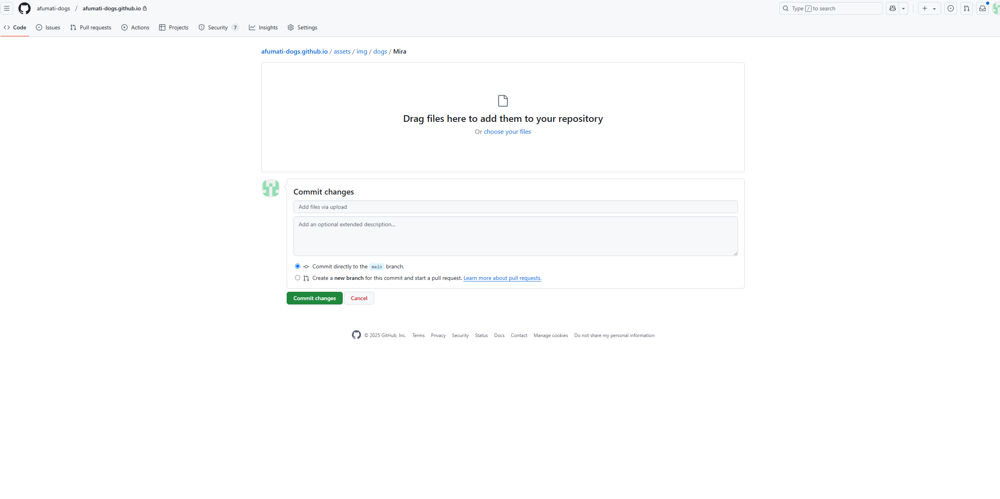

# afumati-dogs.github.io

Entwickelt von [Jasmin Kraft](https://github.com/jmetschl)

## Neue Daten hinzufügen:

Je nach Tier die Datei `\_data/cats.yml` oder `\_data/dogs.yml` aufrufen.

Auf \_data klicken:

Auf dogs.yml klicken:

In den Editiermodus wechseln:


Tier anlegen nach folgendem Schema:

```
- name: Alvin
  age: 12.2018
  size: Mittelgroß
  sex: Männlich
  character: lieb
  dog_number: XXXXX
  text_dog: Ein sehr lieber Hund. Er ist sehr anhänglich und liebt es, gestreichelt zu werden. Er ist sehr verspielt und liebt es, mit anderen Hunden zu spielen. Er ist sehr anhänglich und liebt es, gestreichelt zu werden. Er ist sehr verspielt und liebt es, mit anderen Hunden zu spielen. Er ist sehr anhänglich und liebt es, gestreichelt zu werden. Er ist sehr verspielt und liebt es, mit anderen Hunden zu spielen. Er ist sehr anhänglich und liebt es, gestreichelt zu werden. Er ist sehr verspielt und liebt es, mit anderen Hunden zu spielen. Er ist sehr anhänglich und liebt es, gestreichelt zu werden. Er ist sehr verspielt und liebt es, mit anderen Hunden zu spielen. Er ist sehr anhänglich und liebt es, gestreichelt zu werden. Er ist sehr verspielt und liebt es, mit anderen Hunden zu spielen. Er ist sehr anhänglich und liebt es, gestreichelt zu werden.
  text_home: Er sucht ein Zuhause mit Garten und Menschen, die viel Zeit für ihn haben. Er ist sehr anhänglich und liebt viel Auslauf. Braucht einen Garten, da er sehr aktiv ist. Kleine Kinder und andere Hunde sind kein Problem für ihn. Er ist sehr sozial und verträglich.
  emergency: true
```

Ist ein Tier ein Notfall und soll auf der Startseite angezeigt werden, muss `emergency` auf true gesetzt werden, sonst kann `emergency` weggelassen werden. In die Liste für `text_dog` und `text_home` dürfen keine Zeilenumbrüche genutzt werden (**also keine Enter Taste**). Aktuell werden nur jeweils 3 Tiere auf der Startseite angezeigt.

Dabei ist die Einrückung sehr wichtig und muss immer gleich sein. Zusätzlich markiert man ein neues Tier mit einem `-`.

Nach Einfügen des Tieres auf `Commit Changes` klicken:

Dialog mit diesen Einstellungen füllen und auf `Commit Changes` klicken:


Die Seite wird danach automatisch mit dem neuem Tier geupdatet!

## Hochladen von Bildern:

Für jedes Tier muss ein Ordner angelegt werden unter `assets/img/[cats/dogs]` je nach Tierart. Der Name des Ordners muss mit dem Namen in dem oben angelegtem Schema übereinstimmen (dabei spielt Groß-und Kleinschreibung keine Rolle). Also für den Hund Alvin beispielsweise müsste der Ordner `assets/img/dogs/alvin` angelegt werden. In dem Ordner können beliebig viele Bilder hochgeladen werden, allerdings werden nur die ersten 5 auf der Webseite dargestellt (die ersten 5 im Ordner, also die ersten 5 nach Namen alphabetisch sortiert). Das erste Bild im Ordner (vielleicht mit dem Namen `a.jpg`) wird als Hauptbild für den Hund zugeordnet.

Auf assets klicken:

Danach auf Img klicken;
Dann auf `Add File` klicken und im Dropdown `Create new File` auswählen:

Es öffnet sich der Fileeditor mit dem Feld zum Eingeben eines Filenamens:

In diesem Feld erst den TierTyp also dogs oder cats eingeben und anschließend einen `/` tippen; Dadurch wird ein Ordner erstellt. Als nächstes den Tiernamen eingeben und anschließend einen /`; dann als Name des Files: `.gitkeep` angeben. Das Ganze sieht dann so aus:

Auf `Commit Changes` klicken und den Dialog bestätigen:

Es öffnet sich der erstellte Ordner.
Auf `Upload Files` klicken und Bilder auswählen.
Anschließend wieder auf `Commit Changes` klicken.


Die Seite wird danach automatisch mit dem neuen Bildern geupdatet!
